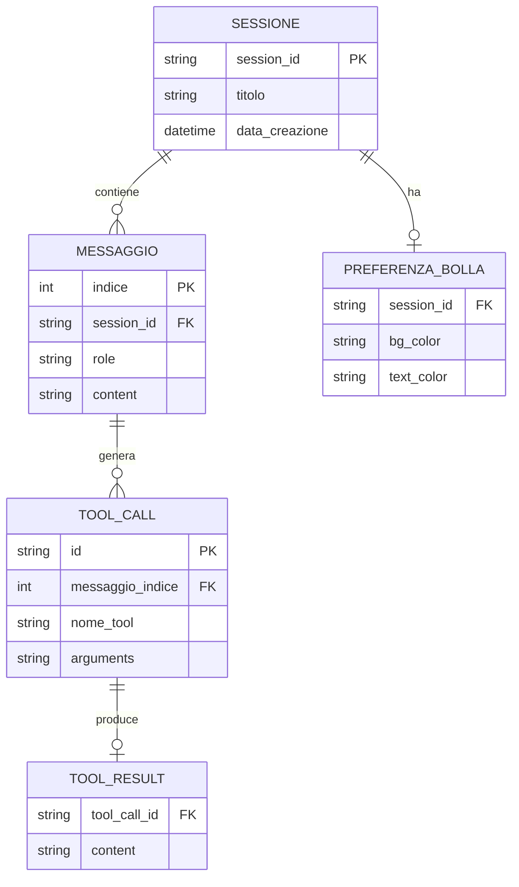
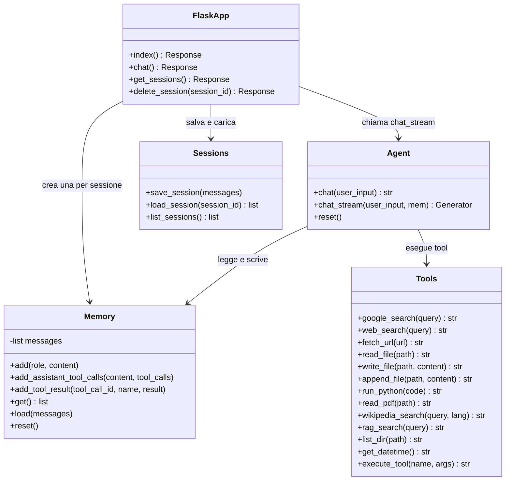
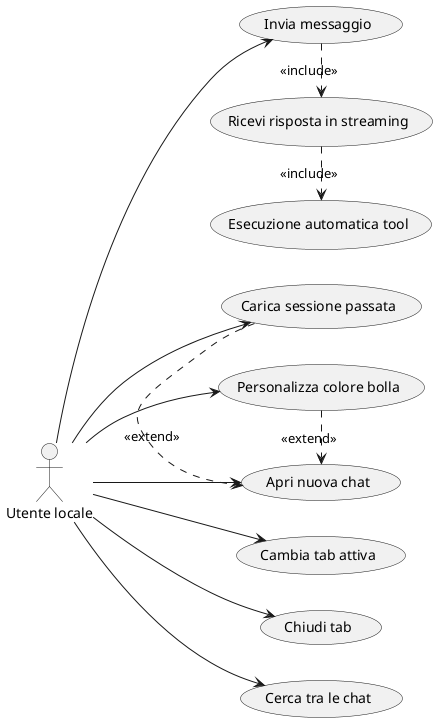
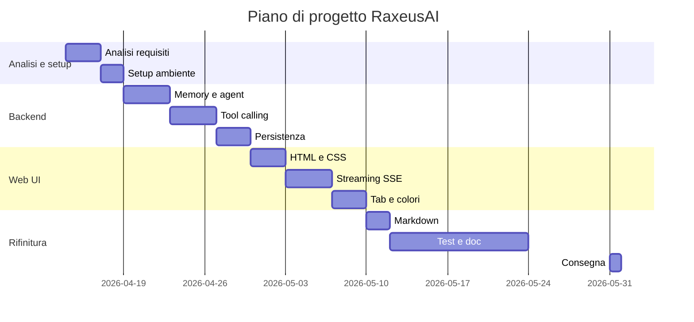

# Documento dei Requisiti — RaxeusAI

> Progetto di fine anno per il modulo `03_Sviluppo_Web_e_Database`.
> **RaxeusAI** è un assistente AI personale con interfaccia web, sviluppato in Python/Flask con integrazione a un modello linguistico locale tramite Ollama.

## 1. Introduzione

### 1.1 Scopo del documento

Questo documento:
- descrive il prodotto realizzato dallo studente Alberto Bruscolini;
- raccoglie i requisiti funzionali e non funzionali;
- presenta i diagrammi ER, UML e casi d'uso organizzati nelle fasi di analisi, sviluppo e rifinitura;
- definisce la roadmap di lavoro con milestone e Gantt.

### 1.2 Contesto

RaxeusAI è un'applicazione web completa con backend in Python/Flask, interfaccia dinamica con streaming in tempo reale e integrazione con un LLM locale tramite Ollama.

La persistenza non utilizza un database relazionale: le conversazioni sono salvate come file JSON nella cartella `sessions/`, scelta adeguata alla natura single-user dell'applicazione.

### 1.3 Tema

**RaxeusAI** è un assistente AI personale che gira localmente tramite Ollama. Risponde in streaming token per token, esegue tool reali in autonomia e dispone di un'interfaccia web con tab multiple e personalizzazione grafica. Include il modulo **RaxeusLyric** per la visualizzazione sincronizzata dei testi delle canzoni in riproduzione, ed è disponibile come app desktop nativa su macOS tramite pywebview.

## 2. Obiettivi

- Permettere all'utente di conversare con un LLM locale in tempo reale.
- Rispondere in streaming token per token.
- Eseguire tool reali in autonomia: ricerca web, esecuzione Python, lettura/scrittura file, lettura PDF, ricerca Wikipedia, data e ora, esplorazione directory, ricerca RAG su documenti locali.
- Mantenere la memoria conversazionale multi-turno nella sessione corrente.
- Salvare e ricaricare sessioni di chat passate.
- Offrire un'interfaccia web con tab multiple, ricerca nelle chat, tema scuro e color picker per le bolle.
- Offrire un'interfaccia da terminale per uso rapido.
- Visualizzare in tempo reale i testi sincronizzati della canzone in riproduzione su macOS.

## 3. Stakeholder e attori

| Stakeholder | Ruolo | Interesse |
| --- | --- | --- |
| Alberto Bruscolini | Sviluppatore | Realizzare e mantenere il progetto |
| Docente | Valutatore | Verificare correttezza tecnica e completezza |
| Utente finale | Utente singolo locale | Usare l'assistente per domande, ricerche e automazioni |

**Attore principale:** `Utente locale` — l'applicazione è single-user e non prevede autenticazione.

## 4. Requisiti funzionali

### 4.1 Requisiti principali

1. Invio di messaggi all'assistente e ricezione di risposte in streaming.
2. Esecuzione autonoma di tool: ricerca web (Google e DuckDuckGo), lettura e scrittura file, esecuzione Python, lettura PDF, ricerca Wikipedia, data e ora, esplorazione directory, ricerca RAG su documenti locali.
3. Memoria conversazionale multi-turno: l'intera cronologia viene mantenuta e passata al modello a ogni turno.
4. Gestione di sessioni multiple: creazione, navigazione, eliminazione e ricerca tra le chat.
5. Persistenza su file JSON: le sessioni sono salvate in `sessions/` e ricaricate automaticamente all'avvio.
6. Interfaccia web con tab multiple, barra di ricerca e color picker per le bolle utente.
7. Rendering del markdown nelle risposte (titoli, codice, tabelle, grassetto).
8. Interfaccia terminale con comandi `reset`, `salva`, `sessioni`, `carica <N>`, `esci`.
9. Caricamento di fino a 3 immagini per messaggio; il modello vision le analizza e risponde anche in assenza di testo.
10. Modulo RaxeusLyric: identificazione della canzone in riproduzione, recupero e visualizzazione del testo sincronizzato.
11. App desktop nativa su macOS tramite pywebview (`launcher.py` + `create_app.sh`).

### 4.2 User stories

- L'utente invia un messaggio e vede la risposta apparire in tempo reale, token per token.
- L'assistente cerca autonomamente informazioni su internet quando necessario, senza che l'utente lo richieda esplicitamente.
- L'utente mantiene più conversazioni aperte contemporaneamente in tab separate.
- L'utente ritrova una conversazione passata cercandola per parola chiave.
- L'utente personalizza il colore delle bolle dei messaggi per ogni chat.
- Le conversazioni vengono salvate automaticamente e ricaricate al prossimo avvio.
- L'utente allega fino a 3 immagini a un messaggio; l'assistente ne analizza il contenuto e risponde anche senza testo di accompagnamento.
- L'utente visualizza i testi della canzone in riproduzione sincronizzati in tempo reale.

## 5. Requisiti non funzionali

- L'applicazione funziona localmente senza connessione obbligatoria (il modello è locale via Ollama).
- Le risposte sono trasmesse in streaming tramite Server-Sent Events (SSE).
- Il backend è realizzato con Python/Flask.
- Il progetto è eseguibile con un ambiente virtuale Python (`venv`).
- L'interfaccia web ha tema scuro e layout responsivo.
- Le sessioni sono persistenti tra un avvio e l'altro.
- Il codice è organizzato in moduli separati con responsabilità chiare.

## 6. Glossario

- `LLM`: Large Language Model — modello di linguaggio che genera testo.
- `Ollama`: strumento per eseguire LLM localmente sul proprio computer.
- `Tool calling`: capacità del modello di richiamare funzioni esterne durante la generazione della risposta.
- `Streaming`: tecnica che invia la risposta token per token man mano che viene generata.
- `SSE` (Server-Sent Events): protocollo HTTP per aggiornamenti in tempo reale dal server al browser.
- `Sessione`: conversazione singola identificata da UUID, salvata come file JSON.
- `Memoria conversazionale`: cronologia dei messaggi della sessione corrente, passata al modello a ogni turno.
- `RAG` (Retrieval-Augmented Generation): ricerca su documenti locali indicizzati in ChromaDB, utilizzata come tool dall'agente.
- `Tab`: scheda nella web UI che rappresenta una sessione di chat aperta.

## 7. Modello dei dati

La persistenza è gestita tramite file JSON nella cartella `sessions/`. Lo schema ER seguente rappresenta le entità e le relazioni in forma concettuale.

### 7.1 Schema ER concettuale



### 7.2 Struttura di una sessione (file JSON)

```json
{
  "session_id": "uuid-v4",
  "messages": [
    { "role": "user", "content": "Testo del messaggio" },
    { "role": "assistant", "content": "Risposta dell'AI" },
    {
      "role": "assistant",
      "content": "",
      "tool_calls": [
        {
          "id": "tool-id",
          "type": "function",
          "function": { "name": "google_search", "arguments": "{\"query\": \"...\"}" }
        }
      ]
    },
    { "role": "tool", "tool_call_id": "tool-id", "name": "google_search", "content": "risultato" }
  ]
}
```

### 7.3 Dati nel browser (localStorage)

| Chiave | Valore |
| --- | --- |
| `chat_<session_id>` | Array JSON dei messaggi della chat |
| `bubble_color_<session_id>` | Oggetto JSON `{ bg, text }` con il colore della bolla |

## 8. Diagramma UML delle classi



## 9. Casi d'uso

### 9.1 Casi d'uso principali

1. `Invia messaggio`
2. `Ricevi risposta in streaming`
3. `Esecuzione automatica tool`
4. `Apri nuova chat`
5. `Cambia tab attiva`
6. `Chiudi tab`
7. `Cerca tra le chat`
8. `Personalizza colore bolla`
9. `Carica sessione passata`

### 9.2 Descrizione dei casi d'uso

- **Invia messaggio**: l'utente digita un testo e preme Invio; il frontend invia la richiesta via POST a `/chat` con testo e ID sessione.
- **Ricevi risposta in streaming**: il backend apre una connessione SSE e invia token per token; il frontend aggiorna la bolla in tempo reale.
- **Esecuzione automatica tool**: durante la generazione il modello decide autonomamente di chiamare un tool (es. `google_search`); il backend esegue il tool e rimanda il risultato al modello prima di continuare la risposta.
- **Apri nuova chat**: l'utente clicca `+`; viene creata una nuova tab con UUID univoco e titolo automatico al primo messaggio.
- **Cerca tra le chat**: l'utente digita nella barra di ricerca; le tab vengono filtrate in tempo reale per titolo.
- **Personalizza colore bolla**: l'utente clicca il pallino colorato, sceglie un preset o un colore custom; il colore viene salvato in localStorage per la sessione attiva.
- **Carica sessione passata**: l'utente seleziona una sessione salvata dalla lista; la cronologia viene ripristinata nella tab corrente.

### 9.3 Relazioni tra casi d'uso: include ed extend

- `<<include>>`: comportamento obbligatorio sempre eseguito all'interno del caso d'uso base.
- `<<extend>>`: comportamento opzionale che si aggiunge al caso d'uso base solo in certe condizioni.

Relazioni principali:

- `Invia messaggio` <<include>> `Ricevi risposta in streaming`: ogni messaggio produce sempre una risposta in streaming.
- `Ricevi risposta in streaming` <<include>> `Esecuzione automatica tool`: il tool calling è parte integrante del ciclo di risposta ogni volta che il modello lo attiva.

Relazioni extend:

- `Carica sessione passata` <<extend>> `Apri nuova chat`: l'utente può aprire una chat preesistente invece di crearne una nuova.
- `Personalizza colore bolla` <<extend>> `Apri nuova chat`: la personalizzazione del colore è opzionale e disponibile dopo aver aperto una chat.

### 9.4 Diagramma dei casi d'uso



## 10. Pianificazione e milestone

| Settimana | Attività |
| --- | --- |
| 1 (14–18 apr) | Analisi requisiti, schema ER e UML, setup ambiente (Ollama, venv, Flask) |
| 2 (22–25 apr) | Backend: memoria conversazionale e agent loop con streaming |
| 3 (28 apr–2 mag) | Tool calling: web search, file, Python, PDF, Wikipedia, RAG |
| 4 (5–9 mag) | Web UI: template HTML, streaming SSE |
| 5 (12–16 mag) | Tab management, color picker, markdown rendering |
| 6 (19–31 mag) | Testing, correzioni bug, documentazione, consegna su GitHub |

**Consegna prevista: 31 maggio 2026.**

### 10.1 Gantt


