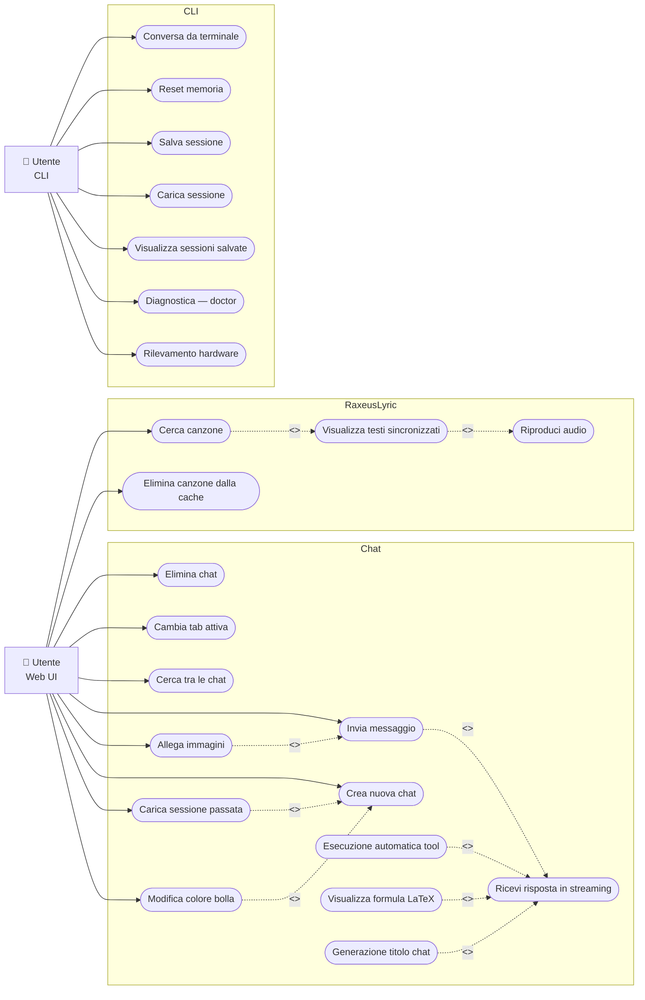
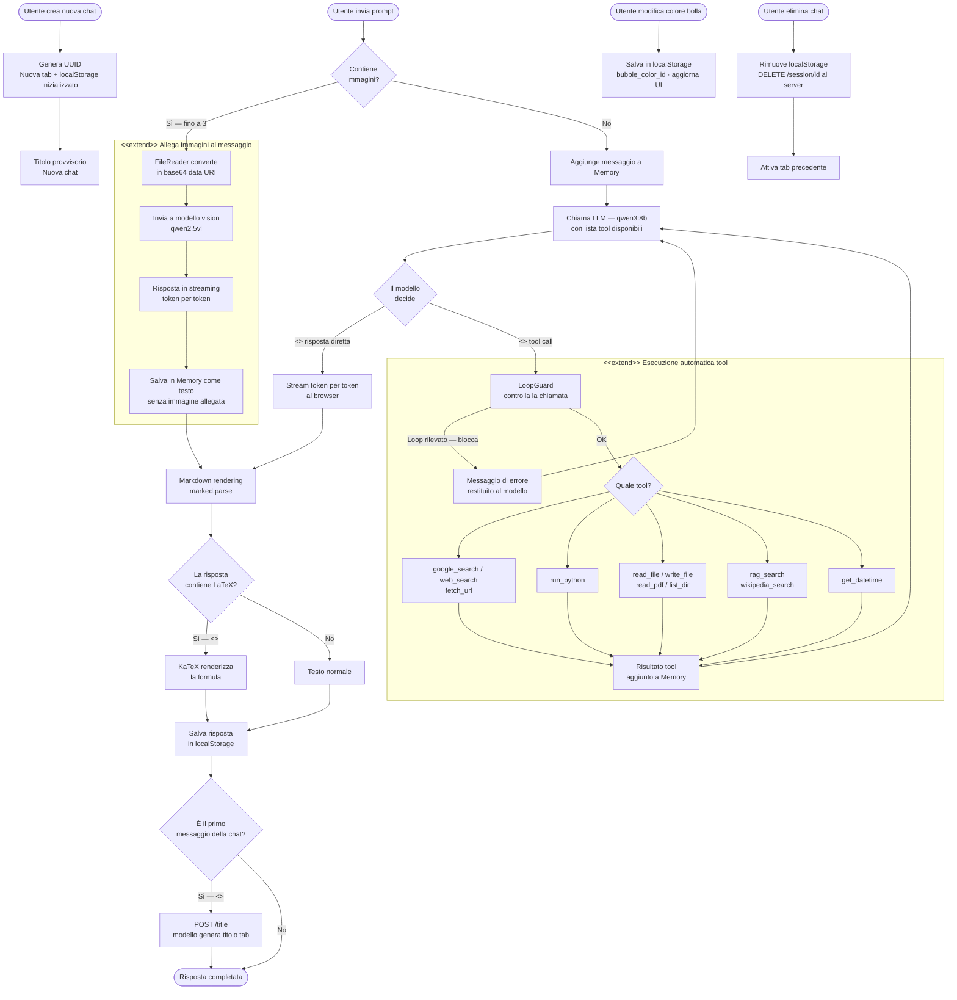
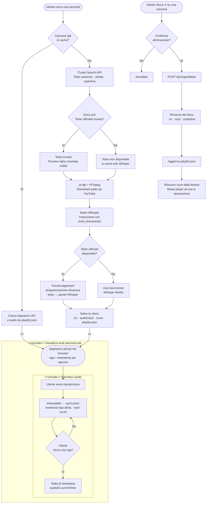
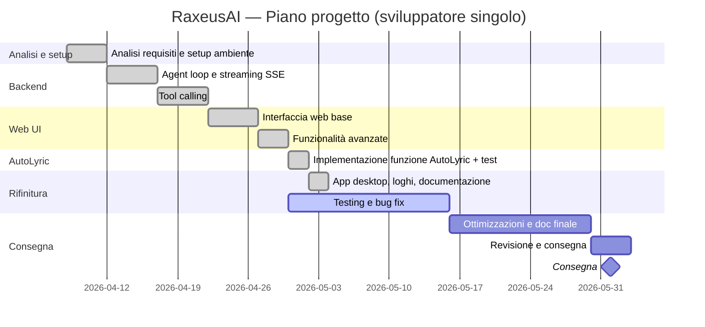

# Documento dei Requisiti — RaxeusAI

> **Studente:** Alberto Bruscolini

---

## 1. Introduzione

### 1.1 Scopo del documento

Questo documento:

- raccoglie i requisiti funzionali e non funzionali;
- presenta i diagrammi e i casi d'uso organizzati nelle fasi di analisi, sviluppo e rifinitura;
- definisce la roadmap di lavoro con milestone e Gantt.

### 1.2 Contesto

RaxeusAI è un'applicazione web completa con backend in Python/Flask, interfaccia dinamica con streaming in tempo reale e integrazione con un LLM locale tramite Ollama.

La persistenza non utilizza un database relazionale: le conversazioni vengono salvate come file JSON nella cartella `sessions/`, scelta coerente con la natura single-user dell'applicazione. I documenti personali dell'utente vengono invece indicizzati in un database vettoriale (ChromaDB) per la funzionalità RAG.

### 1.3 Tema d'esempio

**RaxeusAI** è un assistente AI personale che gira completamente offline tramite Ollama. Risponde in streaming token per token, esegue tool reali in autonomia (anche più tool in parallelo nello stesso turno), e dispone di un'interfaccia web con tab multiple, tema scuro, personalizzazione grafica, rendering formule matematiche tramite **KaTeX** e generazione automatica del titolo della chat tramite AI.

Include il modulo **RaxeusLyric** per la ricerca e visualizzazione karaoke di testi musicali sincronizzati in tempo reale. È disponibile come app desktop nativa sia su **macOS** (bundle `.app`) sia su **Windows** (eseguibile `.exe` via PyInstaller), ed è dotato di sistemi di robustezza ispirati al framework open-source [OpenJarvis](https://github.com/open-jarvis/OpenJarvis): LoopGuard contro i loop nel tool calling, compressione automatica del context, hardware detection con raccomandazione del modello e comando `doctor` per la diagnostica.

---

## 2. Obiettivi generali

- Permettere all'utente di conversare con un LLM locale in tempo reale, con risposte in streaming token per token.
- Eseguire tool reali in autonomia: ricerca web (Google e DuckDuckGo), esecuzione di codice Python, lettura/scrittura file, lettura PDF, ricerca Wikipedia, data e ora, esplorazione directory, ricerca RAG su documenti locali.
- Eseguire più tool call in parallelo nello stesso turno per ridurre la latenza.
- Mantenere la memoria conversazionale multi-turno con compressione automatica della cronologia oltre i 100 messaggi.
- Bloccare loop degeneri nel tool calling (chiamate identiche ripetute, pattern ping-pong, budget per tool).
- Gestire sessioni multiple: creazione, navigazione, eliminazione, ricerca e persistenza su file.
- Offrire un'interfaccia web con tab multiple, ricerca nelle chat, tema scuro e color picker per le bolle.
- Renderizzare formule matematiche LaTeX nelle risposte tramite KaTeX.
- Generare automaticamente il titolo della chat in base all'argomento discusso.
- Analizzare immagini allegate ai messaggi tramite un modello vision dedicato.
- Visualizzare in tempo reale i testi sincronizzati di una canzone ricercata dall'utente (modulo RaxeusLyric).
- Funzionare in modo identico su **macOS**, **Windows** e **Linux**, sia come applicazione web sia come app desktop nativa.

---

## 3. Stakeholder e attori

| Stakeholder | Ruolo | Interesse |
| --- | --- | --- |
| Alberto Bruscolini | Sviluppatore | Realizzare e mantenere il progetto |
| Docente | Valutatore | Verificare correttezza tecnica e completezza dei requisiti |
| Utente finale | Utente singolo locale | Usare l'assistente per domande, ricerche e automazioni |

### Attori principali

**Utente locale (Web UI)** — interagisce con l'assistente tramite il browser o l'app desktop nativa; gestisce le chat, allega immagini e usa il modulo RaxeusLyric.

**Utente locale (CLI)** — interagisce con l'assistente da terminale; usa i comandi diagnostici `doctor` e `hardware`, gestisce sessioni manualmente.

L'applicazione è **single-user** e non prevede autenticazione né registrazione.

---

## 4. Requisiti funzionali

### 4.1 Requisiti principali

| # | Requisito |
| --- | --- |
| RF-01 | Invio di messaggi all'assistente e ricezione delle risposte in streaming token per token. |
| RF-02 | Esecuzione autonoma di tool: ricerca web (Google + DuckDuckGo), lettura/scrittura file, esecuzione Python, lettura PDF, ricerca Wikipedia, data e ora, esplorazione directory, ricerca RAG. |
| RF-03 | Memoria conversazionale multi-turno: la cronologia completa viene passata al modello a ogni turno. |
| RF-04 | Compressione automatica della cronologia quando supera 100 messaggi (sliding window + troncamento tool result vecchi). |
| RF-05 | Esecuzione parallela dei tool call quando il modello ne emette più di uno nello stesso turno. |
| RF-06 | Protezione anti-loop: rilevamento di chiamate identiche ripetute, pattern ping-pong A-B-A-B e budget massimo per singolo tool (LoopGuard). |
| RF-07 | Gestione sessioni multiple: creazione, navigazione, chiusura, ricerca e persistenza su file JSON. |
| RF-08 | Interfaccia web con tab multiple, barra di ricerca, color picker per le bolle utente e tema scuro. |
| RF-09 | Rendering del markdown nelle risposte (titoli, codice, tabelle, grassetto, liste). |
| RF-10 | Rendering formule matematiche LaTeX tramite KaTeX (`$...$` inline, `$$...$$` display), attivo durante lo streaming e al caricamento dalla cache. |
| RF-11 | Generazione automatica del titolo della chat: al termine della prima risposta il modello produce un titolo di 3-4 parole che aggiorna la tab in background. |
| RF-12 | Caricamento di fino a 3 immagini per messaggio; il modello vision le analizza e risponde anche in assenza di testo. |
| RF-13 | Modulo RaxeusLyric: ricerca canzone (iTunes API), recupero testo ufficiale (lyrics.ovh), download audio (yt-dlp + FFmpeg), trascrizione con timestamp per parola (faster-Whisper), forced alignment testo-audio (programmazione dinamica), visualizzazione karaoke sincronizzata, cache locale LRC + mp3. |
| RF-14 | App desktop nativa su macOS tramite pywebview + bundle `.app` generato da `create_app.sh`. |
| RF-15 | *(rimosso)* — App desktop su Windows non supportata in questa release: il codice cross-cutting (`launcher.py`, notifiche, auto-start Ollama) è macOS-only. Su Windows resta disponibile la sola modalità CLI (`python main.py`). Vedi [docs/BUGS.md BUG-011](docs/BUGS.md). |
| RF-16 | Rilevamento hardware (CPU, RAM, GPU) e raccomandazione automatica del modello Qwen3 più adatto. |
| RF-17 | Comando `doctor`: diagnostica completa di versione Python, raggiungibilità Ollama, modelli e dipendenze, con report a checklist `✓` / `!` / `✗`. |
| RF-18 | Interfaccia terminale con comandi `reset`, `salva`, `sessioni`, `carica <N>`, `doctor`, `hardware`, `esci`. |

### 4.2 User stories

- **Come utente**, voglio inviare un messaggio e vedere la risposta apparire in tempo reale, token per token, senza attendere il completamento.
- **Come utente**, voglio che l'assistente cerchi informazioni su internet autonomamente quando non le conosce, senza che io debba chiederlo esplicitamente.
- **Come utente**, voglio tenere più conversazioni aperte contemporaneamente in tab separate e passare da una all'altra.
- **Come utente**, voglio ritrovare una vecchia conversazione cercandola per parola chiave nella barra di ricerca.
- **Come utente**, voglio personalizzare il colore delle bolle dei miei messaggi per ogni chat.
- **Come utente**, voglio che le mie conversazioni vengano salvate automaticamente e siano disponibili alla prossima apertura dell'app.
- **Come utente**, voglio allegare fino a 3 immagini a un messaggio per farle analizzare dall'assistente.
- **Come utente**, voglio vedere le formule matematiche renderizzate graficamente invece di leggere i simboli LaTeX grezzi.
- **Come utente**, voglio che il titolo della tab si aggiorni automaticamente con l'argomento discusso senza doverlo inserire manualmente.
- **Come utente**, voglio cercare una canzone e vedere il testo scorrere sincronizzato con la musica in tempo reale.
- **Come utente CLI**, voglio eseguire un comando `doctor` per sapere subito se tutto il sistema è configurato correttamente.
- **Come utente CLI**, voglio sapere qual è il modello Qwen3 più adatto al mio hardware prima di configurare l'applicazione.

---

## 5. Requisiti non funzionali

| # | Requisito |
| --- | --- |
| RNF-01 | **Offline-first**: il modello LLM gira localmente tramite Ollama; non è richiesta connessione internet per la chat (i tool di ricerca web la usano solo se invocati). |
| RNF-02 | **Streaming SSE**: le risposte vengono trasmesse tramite Server-Sent Events; il browser riceve e visualizza i token man mano che vengono generati. |
| RNF-03 | **Backend Python/Flask**: tutto il server è scritto in Python 3.10+ con Flask; nessun framework frontend pesante. |
| RNF-04 | **Ambiente virtuale**: il progetto è installabile e avviabile tramite `venv` e `pip install -r requirements.txt`. |
| RNF-05 | **Tema scuro responsivo**: l'interfaccia web usa variabili CSS, si adatta a qualsiasi larghezza e non usa framework CSS esterni. |
| RNF-06 | **Persistenza sessioni**: le conversazioni sopravvivono al riavvio dell'app e vengono ripristinate automaticamente. |
| RNF-07 | **Modularità**: ogni responsabilità è in un modulo separato (`memory.py`, `agent.py`, `tools.py`, `sessions.py`, `loop_guard.py`, ecc.). |
| RNF-08 | **Cross-platform**: subprocess Python usano `sys.executable`; path con `os.path.join`; rilevamento hardware con API native per ogni OS. |
| RNF-09 | **Gestione del context**: la compressione automatica della cronologia evita di saturare la finestra del modello durante chat molto lunghe. |
| RNF-10 | **Robustezza agente**: LoopGuard blocca silenziosamente i loop restituendo un messaggio di errore al modello invece di sollevare eccezioni. |

---

## 6. Casi d'uso

### 6.1 Casi d'uso essenziali

**Web UI — Chat:**

1. `Invia messaggio`
2. `Allega immagini al messaggio`
3. `Ricevi risposta in streaming`
4. `Esecuzione automatica tool`
5. `Visualizza formula matematica`
6. `Generazione automatica titolo chat`
7. `Crea nuova chat`
8. `Elimina chat`
9. `Cambia tab attiva`
10. `Cerca tra le chat`
11. `Carica sessione passata`
12. `Modifica colore bolla`

**Web UI — RaxeusLyric:**

13. `Cerca canzone`
14. `Visualizza testi sincronizzati`
15. `Riproduci audio`
16. `Elimina canzone dalla cache`

**CLI:**

17. `Conversa da terminale`
18. `Reset memoria`
19. `Salva sessione`
20. `Carica sessione`
21. `Visualizza sessioni salvate`
22. `Diagnostica del sistema (doctor)`
23. `Rilevamento hardware`

### 6.2 Descrizione semplificata dei casi d'uso

| Caso d'uso | Descrizione |
| --- | --- |
| **Invia messaggio** | L'utente digita un testo nella textarea e preme Invio (o "invia"); il frontend esegue una POST a `/chat` con testo, session ID e le eventuali immagini in base64. |
| **Allega immagini al messaggio** | L'utente seleziona fino a 3 file immagine; `FileReader` li converte in data URI, mostra le anteprime nella strip e li include nel payload all'invio; il backend li instrada al modello vision. |
| **Ricevi risposta in streaming** | Il backend apre una connessione SSE e invia eventi `token` con ogni chunk; il frontend aggiorna la bolla AI in tempo reale eseguendo `marked.parse()` e `renderMathInElement()` a ogni aggiornamento. |
| **Esecuzione automatica tool** | Quando il modello emette una o più `tool_call`, il backend le esegue (anche in parallelo tramite `ThreadPoolExecutor`) e restituisce i risultati; il LoopGuard blocca chiamate identiche ripetute o pattern ping-pong. |
| **Visualizza formula matematica** | Le espressioni LaTeX (`$...$`, `$$...$$`) nella risposta vengono renderizzate da KaTeX sia durante lo streaming che al ricaricamento dalla cache. |
| **Generazione automatica titolo chat** | Al termine della prima risposta il frontend chiama `POST /title`; il backend invoca `generate_title()` che produce un titolo di 3-4 parole e la tab si aggiorna in background. |
| **Crea nuova chat** | L'utente clicca `+`; viene generato un UUID univoco, aggiunta una tab "Nuova chat" e inizializzato il localStorage per quella sessione. |
| **Elimina chat** | L'utente clicca `×` sulla tab; il frontend rimuove i dati dal localStorage e chiama `DELETE /session/<id>` al server, poi attiva la tab precedente. |
| **Cambia tab attiva** | L'utente clicca su una tab esistente; il frontend carica la cronologia dal localStorage e ridisegna la chat. |
| **Cerca tra le chat** | L'utente digita nella barra di ricerca; le tab vengono filtrate in tempo reale per titolo (case-insensitive). |
| **Carica sessione passata** | All'avvio vengono recuperate le ultime 5 sessioni dal server; selezionandone una, la cronologia viene ripristinata nella tab. |
| **Modifica colore bolla** | L'utente clicca il pallino colorato, sceglie un preset (6 colori) o un colore custom tramite color picker; la scelta viene salvata in `localStorage` con chiave `bubble_color_<id>`. |
| **Cerca canzone** | L'utente digita il nome di una canzone; il frontend apre un `EventSource` su `/lyric/api/process`; il backend esegue la pipeline iTunes → lyrics.ovh → yt-dlp → Whisper → forced alignment con eventi SSE di avanzamento e keepalive ogni 15 s. |
| **Visualizza testi sincronizzati** | I segmenti LRC con timestamp vengono renderizzati come righe cliccabili; `syncLyrics()` evidenzia parola per parola la riga attiva a ogni `timeupdate`, con auto-scroll disattivabile per 2,5 s. |
| **Riproduci audio** | Il player usa `<audio>` nativo con seek sulla barra di avanzamento e supporto Range HTTP; play/pausa, tempo corrente e totale sono mostrati nel player bar. |
| **Elimina canzone dalla cache** | L'utente clicca `✕` sulla canzone in libreria; dopo conferma il frontend chiama `POST /lyric/api/delete`; il backend rimuove file `.lrc`, `.mp3` e copertina, aggiorna `playlist.json`. |
| **Conversa da terminale** | L'utente interagisce con l'assistente da CLI tramite `python main.py`; le risposte vengono stampate token per token su stdout con lo stesso loop agent della Web UI. |
| **Reset memoria** | Il comando `reset` svuota la cronologia della sessione corrente in memoria senza toccare i file salvati. |
| **Salva sessione** | Il comando `salva` scrive la cronologia corrente su disco in `sessions/session_<id>.json` escludendo il messaggio di sistema. |
| **Carica sessione** | Il comando `carica <N>` ripristina la sessione N-esima dalla lista; la cronologia viene caricata nella memoria attiva. |
| **Visualizza sessioni salvate** | Il comando `sessioni` elenca i file di sessione disponibili con il loro indice progressivo. |
| **Diagnostica del sistema** | Il comando `doctor` verifica Python ≥ 3.10, raggiungibilità di Ollama, presenza dei modelli configurati e delle dipendenze; stampa un report `✓` / `!` / `✗`. |
| **Rilevamento hardware** | Il comando `hardware` rileva CPU, RAM e GPU (NVIDIA via `nvidia-smi`, Apple via `system_profiler`), calcola la memoria disponibile e suggerisce il tier Qwen3 più adatto. |

### 6.3 Relazioni tra casi d'uso: include ed extend

**Definizioni:**

- `<<include>>` — il caso d'uso base **include sempre** il sotto-caso; il comportamento è obbligatorio e invariante.
- `<<extend>>` — il sotto-caso **estende opzionalmente** il base; si attiva solo al verificarsi di una condizione specifica.

**Relazioni `<<include>>`:**

| Base | → | Include |
| --- | --- | --- |
| `Invia messaggio` | include | `Ricevi risposta in streaming` |
| `Cerca canzone` | include | `Visualizza testi sincronizzati` |
| `Visualizza testi sincronizzati` | include | `Riproduci audio` |

**Relazioni `<<extend>>`:**

| Extend | → | Base | Condizione |
| --- | --- | --- | --- |
| `Allega immagini al messaggio` | extend | `Invia messaggio` | Se l'utente ha selezionato almeno un'immagine prima dell'invio |
| `Esecuzione automatica tool` | extend | `Ricevi risposta in streaming` | Se il modello emette una o più `tool_call` durante la generazione |
| `Visualizza formula matematica` | extend | `Ricevi risposta in streaming` | Se la risposta contiene espressioni LaTeX |
| `Generazione automatica titolo chat` | extend | `Ricevi risposta in streaming` | Solo al completamento della prima risposta nella chat |
| `Carica sessione passata` | extend | `Crea nuova chat` | Se l'utente sceglie di aprire una sessione esistente invece di crearne una nuova |
| `Modifica colore bolla` | extend | `Crea nuova chat` | Personalizzazione opzionale disponibile su qualsiasi chat aperta |

### 6.4 Diagramma dei casi d'uso

### 6.5 Flusso di elaborazione del prompt

### 6.6 Flusso AutoLyric — ricerca e sincronizzazione canzone

---

## 7. Glossario dei termini

| Termine | Definizione |
| --- | --- |
| **LLM** | Large Language Model — modello di linguaggio addestrato su grandi corpus di testo che genera risposte token per token. |
| **Ollama** | Strumento open-source per eseguire modelli LLM localmente; espone un'API compatibile con OpenAI. |
| **Token** | Unità minima di testo elaborata dal modello (circa 3-4 caratteri in media). |
| **Tool calling** | Capacità del modello di richiamare funzioni esterne durante la generazione, riceverne il risultato e continuare la risposta. |
| **Streaming** | Tecnica che invia la risposta token per token man mano che viene generata, invece di aspettare il completamento. |
| **SSE** | Server-Sent Events — protocollo HTTP per aggiornamenti push unidirezionali dal server al browser su una connessione persistente. |
| **Sessione** | Conversazione singola identificata da UUID, salvata come file JSON in `sessions/`. |
| **Memoria conversazionale** | Lista dei messaggi della sessione corrente, passata integralmente al modello a ogni turno. |
| **RAG** | Retrieval-Augmented Generation — tecnica che arricchisce la risposta del modello con documenti locali recuperati tramite ricerca semantica vettoriale (ChromaDB). |
| **ChromaDB** | Database vettoriale embedded in Python; usato da RaxeusAI per indicizzare e cercare documenti locali. |
| **Tab** | Scheda nella web UI che rappresenta una sessione di chat aperta. |
| **LoopGuard** | Modulo che protegge l'agente da loop di tool calling; rileva chiamate identiche ripetute, pattern ping-pong e budget esauriti per singolo tool. Ispirato a OpenJarvis. |
| **OpenJarvis** | Framework open-source (Apache 2.0) da cui RaxeusAI prende spunto per LoopGuard, esecuzione parallela dei tool, compressione del context, hardware detection e comando `doctor`. |
| **KaTeX** | Libreria JavaScript per il rendering rapido di formule matematiche LaTeX nel browser. |
| **pywebview** | Libreria Python che apre una finestra nativa con WebKit (WKWebView su macOS, Edge WebView2 su Windows) puntata a un server Flask locale. |
| **PyInstaller** | Tool che impacchetta un progetto Python in un eseguibile standalone (`.exe`); usato su Windows. |
| **Vision model** | Modello multimodale capace di ricevere immagini come input; in RaxeusAI è configurato tramite `VISION_MODEL` in `config.py`. |
| **Hardware tier** | Classificazione della macchina in base a RAM/VRAM disponibile, usata per suggerire il modello Qwen3 più adatto. |
| **LRC** | Formato standard per testi musicali sincronizzati; ogni riga è preceduta da un timestamp `[mm:ss.xx]`. |
| **Whisper / faster-whisper** | Modello di riconoscimento vocale di OpenAI (addestrato su 680.000 ore); faster-whisper è la reimplementazione con CTranslate2, 4× più veloce e con timestamp per singola parola. |
| **yt-dlp** | Strumento per il download di audio/video da YouTube; usato da RaxeusLyric per scaricare la traccia audio. |
| **Forced alignment** | Algoritmo di programmazione dinamica che allinea le parole del testo ufficiale con le parole trascritte da Whisper (che portano i timestamp), producendo un timestamp preciso per ogni riga. |

---

## 8. Pianificazione e milestone

> Sviluppatore singolo — una attività alla volta. Avvio: **8 aprile 2026**. Consegna: **1 giugno 2026**.

| Settimana | Date | Attività | Stato |
| --- | --- | --- | --- |
| 1 | 8–11 apr | Analisi requisiti e setup ambiente | ✅ |
| 2 | 14–18 apr | Backend core: agent loop e streaming | ✅ |
| 3 | 21–25 apr | Tool calling e Web UI base | ✅ |
| 4 | 28–29 apr | Funzionalità avanzate: immagini, KaTeX, titolo smart | ✅ |
| 4 | 28–29 apr | Implementazione funzione AutoLyric + test | ✅ |
| 4 | 29 apr | App desktop, loghi e documentazione tecnica | ✅ |
| 5–6 | 30 apr–15 mag | Testing generale e bug fix | 🔄 |
| 7–8 | 16–29 mag | Ottimizzazioni, documentazione finale | ⏳ |
| 9 | 30 mag–1 giu | Revisione e consegna | ⏳ |

**Consegna: 1 giugno 2026**

### 8.1 Gantt semplificato

