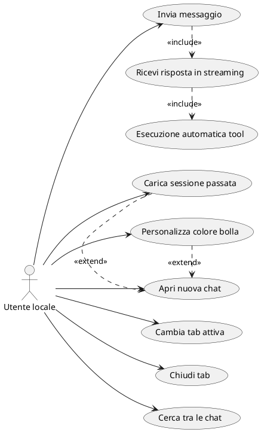
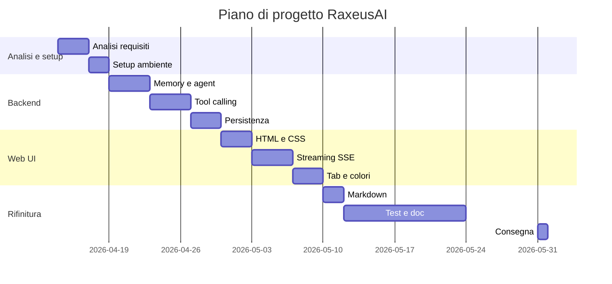

# Documento dei Requisiti — RaxeusAI

> Progetto di fine anno per il modulo `03_Sviluppo_Web_e_Database`.
> **RaxeusAI** è un assistente AI personale con interfaccia web, sviluppato in Python/Flask con integrazione a un modello linguistico locale tramite Ollama.

## 1. Introduzione

### 1.1 Scopo del documento

Questo documento:
- descrive il prodotto realizzato dallo studente Alberto Bruscolini;
- raccoglie i requisiti funzionali e non funzionali;
- presenta i diagrammi e i casi d'uso organizzati nelle fasi di analisi, sviluppo e rifinitura;
- definisce la roadmap di lavoro con milestone e Gantt.

### 1.2 Contesto

RaxeusAI è un'applicazione web completa con backend in Python/Flask, interfaccia dinamica con streaming in tempo reale e integrazione con un LLM locale tramite Ollama.

La persistenza non utilizza un database relazionale: le conversazioni sono salvate come file JSON nella cartella `sessions/`, scelta adeguata alla natura single-user dell'applicazione.

### 1.3 Tema d'esempio

**RaxeusAI** è un assistente AI personale che gira localmente tramite Ollama. Risponde in streaming token per token, esegue tool reali in autonomia (anche più tool in parallelo nello stesso turno) e dispone di un'interfaccia web con tab multiple e personalizzazione grafica. Include il modulo **RaxeusLyric** per la visualizzazione sincronizzata dei testi delle canzoni, è disponibile come app desktop nativa sia su **macOS** (bundle `.app` via `create_app.sh`) sia su **Windows** (bundle `.exe` via `create_app.ps1` + PyInstaller), ed è dotato di sistemi di robustezza ispirati al framework [OpenJarvis](https://github.com/open-jarvis/OpenJarvis): LoopGuard contro le chiamate ripetute, compressione automatica del context, hardware detection con raccomandazione del modello e comando `doctor` per la diagnostica.

## 2. Obiettivi generali

- Permettere all'utente di conversare con un LLM locale in tempo reale.
- Rispondere in streaming token per token.
- Eseguire tool reali in autonomia: ricerca web, esecuzione Python, lettura/scrittura file, lettura PDF, ricerca Wikipedia, data e ora, esplorazione directory, ricerca RAG su documenti locali.
- Eseguire più tool call in parallelo all'interno dello stesso turno per ridurre la latenza.
- Mantenere la memoria conversazionale multi-turno nella sessione corrente, con compressione automatica della cronologia oltre i 100 messaggi.
- Bloccare loop degeneri nel tool calling (chiamate identiche ripetute, ping-pong, budget per tool).
- Salvare e ricaricare sessioni di chat passate.
- Offrire un'interfaccia web con tab multiple, ricerca nelle chat, tema scuro e color picker per le bolle.
- Offrire un'interfaccia da terminale per uso rapido, con comandi diagnostici (`doctor`, `hardware`).
- Visualizzare in tempo reale i testi sincronizzati di una canzone richiesta dall'utente.
- Funzionare in modo identico su **macOS** e **Windows**, sia come applicazione web sia come app desktop nativa.

## 3. Stakeholder e attori

| Stakeholder | Ruolo | Interesse |
| --- | --- | --- |
| Alberto Bruscolini | Sviluppatore | Realizzare e mantenere il progetto |
| Docente | Valutatore | Verificare correttezza tecnica e completezza |
| Utente finale | Utente singolo locale | Usare l'assistente per domande, ricerche e automazioni |

### Attori principali

**Utente locale** — l'unico attore del sistema. L'applicazione è single-user e non prevede autenticazione.

## 4. Requisiti funzionali

### 4.1 Requisiti principali

1. Invio di messaggi all'assistente e ricezione di risposte in streaming.
2. Esecuzione autonoma di tool: ricerca web (Google e DuckDuckGo), lettura e scrittura file, esecuzione Python, lettura PDF, ricerca Wikipedia, data e ora, esplorazione directory, ricerca RAG su documenti locali.
3. Memoria conversazionale multi-turno: l'intera cronologia viene mantenuta e passata al modello a ogni turno.
4. Compressione automatica della cronologia quando supera 100 messaggi (sliding window + troncamento dei tool result più vecchi).
5. Esecuzione parallela dei tool call quando il modello ne emette più di uno nello stesso turno.
6. Protezione anti-loop sull'agente: rilevamento di chiamate identiche ripetute, pattern ping-pong A-B-A-B e budget massimo per singolo tool.
7. Gestione di sessioni multiple: creazione, navigazione, eliminazione e ricerca tra le chat.
8. Persistenza su file JSON: le sessioni sono salvate in `sessions/` e ricaricate automaticamente all'avvio.
9. Interfaccia web con tab multiple, barra di ricerca e color picker per le bolle utente.
10. Rendering del markdown nelle risposte (titoli, codice, tabelle, grassetto).
11. Interfaccia terminale con comandi `reset`, `salva`, `sessioni`, `carica <N>`, `doctor`, `hardware`, `esci`.
12. Caricamento di fino a 3 immagini per messaggio; il modello vision le analizza e risponde anche in assenza di testo.
13. Modulo RaxeusLyric: identificazione della canzone richiesta, recupero e visualizzazione del testo sincronizzato.
14. App desktop nativa su macOS tramite pywebview (`launcher.py` + `create_app.sh` → bundle `.app`).
15. App desktop nativa su Windows tramite pywebview + PyInstaller (`launcher.py` + `create_app.ps1` → eseguibile `.exe`).
16. Rilevamento hardware (CPU, RAM, GPU) e raccomandazione automatica del modello Qwen3 più adatto.
17. Comando `doctor` per la diagnostica completa: versione Python, raggiungibilità Ollama, presenza dei modelli, presenza delle dipendenze.

### 4.2 User stories

- L'utente invia un messaggio e vede la risposta apparire in tempo reale, token per token.
- L'assistente cerca autonomamente informazioni su internet quando necessario, senza che l'utente lo richieda esplicitamente.
- L'utente mantiene più conversazioni aperte contemporaneamente in tab separate.
- L'utente ritrova una conversazione passata cercandola per parola chiave.
- L'utente personalizza il colore delle bolle dei messaggi per ogni chat.
- Le conversazioni vengono salvate automaticamente e ricaricate al prossimo avvio.
- L'utente allega fino a 3 immagini a un messaggio; l'assistente ne analizza il contenuto e risponde anche senza testo di accompagnamento.
- L'utente visualizza i testi della canzone in riproduzione sincronizzati in tempo reale.

## 5. Requisiti non funzionali

- L'applicazione funziona localmente senza connessione obbligatoria (il modello è locale via Ollama).
- Le risposte sono trasmesse in streaming tramite Server-Sent Events (SSE).
- Il backend è realizzato con Python/Flask.
- Il progetto è eseguibile con un ambiente virtuale Python (`venv`).
- L'interfaccia web ha tema scuro e layout responsivo.
- Le sessioni sono persistenti tra un avvio e l'altro.
- Il codice è organizzato in moduli separati con responsabilità chiare.
- Il progetto è cross-platform: tutti i comandi e i moduli funzionano in modo identico su macOS e su Windows. Le subprocess Python usano `sys.executable` invece del binario `python3`, e il rilevamento hardware sceglie l'API corretta in base al sistema operativo.
- Il consumo di context è limitato dalla compressione automatica della cronologia, in modo da non saturare il limite del modello durante chat molto lunghe.
- L'agente è protetto da loop infiniti grazie al modulo LoopGuard ispirato a OpenJarvis.

## 6. Casi d'uso

### 6.1 Casi d'uso essenziali

1. `Invia messaggio`
2. `Ricevi risposta in streaming`
3. `Esecuzione automatica tool`
4. `Apri nuova chat`
5. `Cambia tab attiva`
6. `Chiudi tab`
7. `Cerca tra le chat`
8. `Personalizza colore bolla`
9. `Carica sessione passata`
10. `Allega immagini al messaggio`
11. `Diagnostica del sistema (doctor)`
12. `Rilevamento hardware e raccomandazione modello`

### 6.2 Descrizione semplificata dei casi d'uso

- **Invia messaggio**: l'utente digita un testo e preme Invio; il frontend invia la richiesta via POST a `/chat` con testo e ID sessione.
- **Ricevi risposta in streaming**: il backend apre una connessione SSE e invia token per token; il frontend aggiorna la bolla in tempo reale.
- **Esecuzione automatica tool**: durante la generazione il modello decide autonomamente di chiamare un tool (es. `google_search`); il backend esegue il tool e rimanda il risultato al modello prima di continuare la risposta.
- **Apri nuova chat**: l'utente clicca `+`; viene creata una nuova tab con UUID univoco e titolo automatico al primo messaggio.
- **Cerca tra le chat**: l'utente digita nella barra di ricerca; le tab vengono filtrate in tempo reale per titolo.
- **Personalizza colore bolla**: l'utente clicca il pallino colorato, sceglie un preset o un colore custom; il colore viene salvato in localStorage per la sessione attiva.
- **Carica sessione passata**: l'utente seleziona una sessione salvata dalla lista; la cronologia viene ripristinata nella tab corrente.
- **Allega immagini al messaggio**: l'utente seleziona fino a 3 immagini dal pulsante di upload; le anteprime appaiono accanto alla casella di testo e, all'invio, il modello vision (llava) le analizza e risponde anche in assenza di testo.
- **Diagnostica del sistema (doctor)**: l'utente esegue `python main.py doctor`; il sistema verifica versione Python, raggiungibilità di Ollama, presenza dei modelli configurati e delle dipendenze, restituendo un report a checklist con `✓` / `!` / `✗`.
- **Rilevamento hardware e raccomandazione modello**: l'utente esegue `python main.py hardware`; il sistema rileva CPU, RAM e GPU, e suggerisce il modello Qwen3 (1.7B / 4B / 8B / 14B / 32B) più adatto alle risorse disponibili.

### 6.3 Relazioni tra casi d'uso: include ed extend

- `<<include>>`: comportamento obbligatorio sempre eseguito all'interno del caso d'uso base.
- `<<extend>>`: comportamento opzionale che si aggiunge al caso d'uso base solo in certe condizioni.

Relazioni include:

- `Invia messaggio` <<include>> `Ricevi risposta in streaming`: ogni messaggio produce sempre una risposta in streaming.
- `Ricevi risposta in streaming` <<include>> `Esecuzione automatica tool`: il tool calling è parte integrante del ciclo di risposta ogni volta che il modello lo attiva.

Relazioni extend:

- `Carica sessione passata` <<extend>> `Apri nuova chat`: l'utente può aprire una chat preesistente invece di crearne una nuova.
- `Personalizza colore bolla` <<extend>> `Apri nuova chat`: la personalizzazione del colore è opzionale e disponibile dopo aver aperto una chat.

### 6.4 Diagramma dei casi d'uso

## 7. Glossario dei termini

- `LLM`: Large Language Model — modello di linguaggio che genera testo.
- `Ollama`: strumento per eseguire LLM localmente sul proprio computer.
- `Tool calling`: capacità del modello di richiamare funzioni esterne durante la generazione della risposta.
- `Streaming`: tecnica che invia la risposta token per token man mano che viene generata.
- `SSE` (Server-Sent Events): protocollo HTTP per aggiornamenti in tempo reale dal server al browser.
- `Sessione`: conversazione singola identificata da UUID, salvata come file JSON.
- `Memoria conversazionale`: cronologia dei messaggi della sessione corrente, passata al modello a ogni turno.
- `RAG` (Retrieval-Augmented Generation): ricerca su documenti locali indicizzati in ChromaDB, utilizzata come tool dall'agente.
- `Tab`: scheda nella web UI che rappresenta una sessione di chat aperta.
- `LoopGuard`: modulo che protegge l'agente da loop di tool calling, rilevando chiamate identiche ripetute, pattern ping-pong e budget esauriti per singolo tool. Ispirato all'omonimo componente di OpenJarvis.
- `OpenJarvis`: framework open-source (Apache 2.0) di assistenti AI personali sviluppato dal Stanford Scaling Intelligence Lab, da cui RaxeusAI prende spunto per LoopGuard, esecuzione parallela dei tool, compressione del context, rilevamento hardware e comando `doctor`.
- `pywebview`: libreria Python che incorpora una webview nativa (WKWebView su macOS, Edge WebView2 su Windows) per trasformare l'app Flask in un'app desktop senza dipendenze pesanti.
- `PyInstaller`: tool che impacchetta l'applicazione Python in un eseguibile standalone; usato su Windows per generare il file `.exe` di RaxeusAI.
- `Vision model`: modello multimodale (`llava`) capace di analizzare immagini in input oltre al testo.
- `Hardware tier`: classificazione della macchina in base a RAM e GPU, usata per suggerire il modello Qwen3 più adatto.

## 8. Pianificazione e milestone

| Settimana | Attività |
| --- | --- |
| 1 (14–18 apr) | Analisi requisiti, schema ER e UML, setup ambiente (Ollama, venv, Flask) |
| 2 (22–25 apr) | Backend: memoria conversazionale e agent loop con streaming |
| 3 (28 apr–2 mag) | Tool calling: web search, file, Python, PDF, Wikipedia, RAG |
| 4 (5–9 mag) | Web UI: template HTML, streaming SSE |
| 5 (12–16 mag) | Tab management, color picker, markdown rendering |
| 6 (19–31 mag) | Testing, correzioni bug, documentazione, consegna su GitHub |

**Consegna prevista: 31 maggio 2026.**

### 8.1 Gantt semplificato

