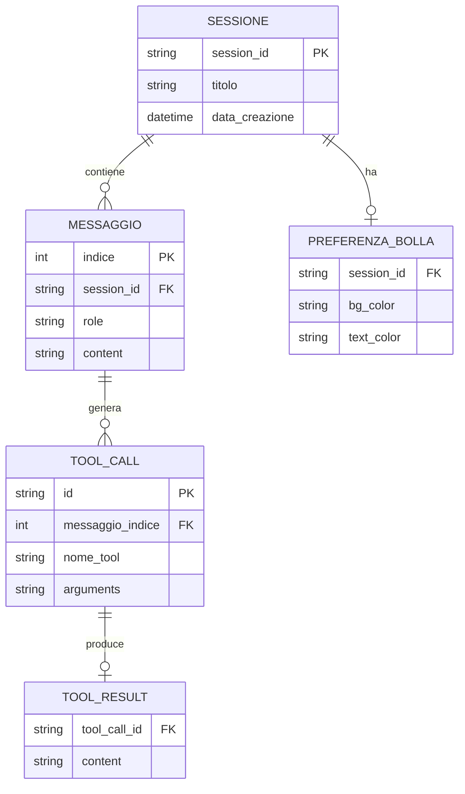
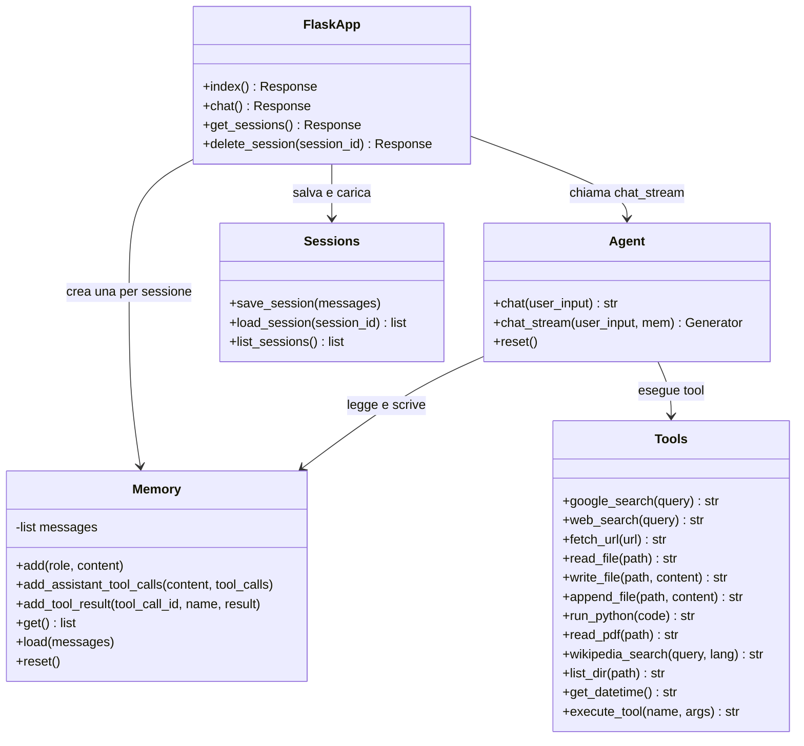
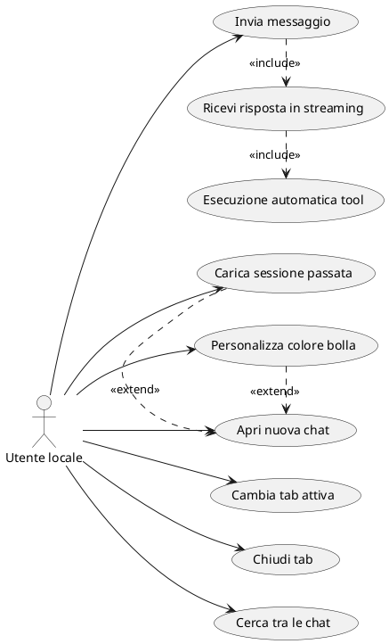
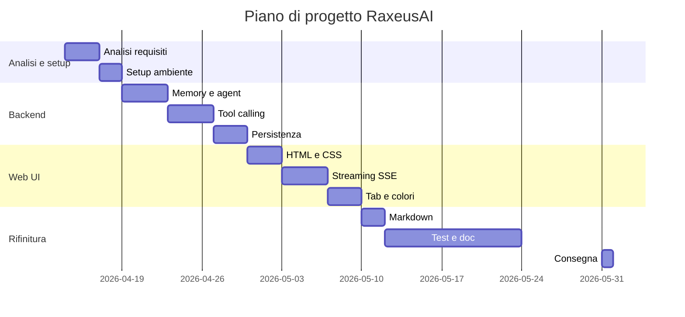

# Documento dei Requisiti

> Questo documento descrive il progetto **RaxeusAI** realizzato per il modulo `03_Sviluppo_Web_e_Database`.
> RaxeusAI è un assistente AI personale con interfaccia web, costruito in Python/Flask con integrazione al modello linguistico locale tramite Ollama.
> Il progetto nasce come iniziativa personale e viene successivamente adottato come progetto scolastico di fine anno.

## 1. Introduzione

### 1.1 Scopo del documento

Lo scopo di questo documento è:
- descrivere in modo chiaro il prodotto realizzato;
- raccogliere i requisiti funzionali e non funzionali;
- fornire una prima progettazione concettuale e una roadmap di lavoro con diagrammi ER, UML e casi d'uso, organizzata nelle fasi di analisi, sviluppo e rifinitura;
- definire una roadmap di lavoro con milestone e attività principali.

### 1.2 Contesto

RaxeusAI nasce come * *progetto personale** — sviluppato autonomamente per uso privato — e viene successivamente adottato come **progetto scolastico di fine anno** per il modulo `03_Sviluppo_Web_e_Database`. Questa doppia origine ha permesso di lavorare su un prodotto reale e funzionante fin dall'inizio, anziché su un esercizio accademico costruito ad hoc.

Il progetto dimostra la realizzazione di un'applicazione web completa con:
- backend in Python/Flask;
- interfaccia web dinamica con streaming e aggiornamenti in tempo reale;
- persistenza dei dati su file;
- integrazione con un modello di linguaggio (LLM) locale tramite Ollama.

Il progetto non utilizza un database relazionale tradizionale: la persistenza delle conversazioni è affidata a file JSON, scelta motivata dalla natura single-user dell'applicazione e dall'assenza di relazioni complesse tra dati strutturati.

### 1.3 Tema

Tema scelto: **RaxeusAI**.
RaxeusAI è un assistente AI personale che gira localmente sul Mac tramite Ollama. Risponde in streaming, usa tool reali in autonomia (ricerca web, esecuzione Python, lettura file, PDF, Wikipedia) e dispone di un'interfaccia web con tab multiple e personalizzazione grafica.

## 2. Obiettivi generali

- Permettere all'utente di conversare con un LLM locale in tempo reale.
- Rispondere in streaming token per token per un'esperienza fluida.
- Eseguire tool reali in autonomia: ricerca web, esecuzione di codice Python, lettura/scrittura file, lettura PDF, ricerca Wikipedia, data e ora.
- Mantenere la memoria conversazionale multi-turno all'interno di una sessione.
- Salvare e ricaricare le sessioni di chat passate.
- Offrire un'interfaccia web con tab multiple, ricerca nelle chat, tema scuro e personalizzazione del colore delle bolle.
- Offrire anche un'interfaccia da terminale per uso rapido.

## 3. Stakeholder e attori

| Stakeholder | Ruolo | Interesse |
| --- | --- | --- |
| Sviluppatore | Alberto Bruscolini | Realizzare e mantenere il progetto |
| Docente | Valutatore | Verificare correttezza tecnica e completezza |
| Utente finale | Utente singolo locale | Usare l'assistente per domande, ricerche e automazioni |

### Attori principali

- `Utente locale` (unico attore — app single-user senza autenticazione)

## 4. Requisiti funzionali

### 4.1 Requisiti principali

1. Invio di messaggi all'assistente AI e ricezione di risposte in streaming.
2. Esecuzione autonoma di tool da parte dell'AI: ricerca web (Google, DuckDuckGo), lettura e scrittura file, esecuzione Python, lettura PDF, ricerca Wikipedia, data e ora corrente, esplorazione directory.
3. Memoria conversazionale multi-turno: il modello ricorda l'intera conversazione nella sessione corrente.
4. Gestione di sessioni multiple: creazione, navigazione, eliminazione e ricerca tra le chat.
5. Persistenza delle sessioni su file JSON: le conversazioni vengono salvate e ricaricate all'avvio.
6. Interfaccia web con tab multiple (max 5 simultanee), barra di ricerca nelle chat e colore bolla personalizzabile.
7. Rendering del markdown nelle risposte (titoli, codice, tabelle, grassetto, ecc.).
8. Interfaccia terminale con comandi `reset`, `salva`, `sessioni`, `carica <N>`, `esci`.

### 4.2 User stories

- Come **utente**, voglio inviare un messaggio e vedere la risposta apparire in tempo reale, parola per parola.
- Come **utente**, voglio che l'assistente cerchi informazioni su internet senza doverlo chiedere esplicitamente.
- Come **utente**, voglio avere più conversazioni aperte contemporaneamente in tab separate.
- Come **utente**, voglio ritrovare una conversazione passata cercandola per parola chiave.
- Come **utente**, voglio personalizzare il colore delle bolle dei messaggi per ogni chat.
- Come **utente**, voglio che le mie conversazioni vengano salvate automaticamente e ricaricate al prossimo avvio.

## 5. Requisiti non funzionali

- L'app deve girare localmente senza connessione obbligatoria (il modello AI è locale via Ollama).
- Le risposte devono essere trasmesse in streaming tramite Server-Sent Events (SSE).
- Il backend deve essere realizzato con Python/Flask.
- Il progetto deve essere eseguibile localmente con un ambiente virtuale Python (`venv`).
- L'interfaccia web deve avere tema scuro e layout reattivo.
- Le sessioni devono essere persistenti tra un avvio e l'altro (file JSON nella cartella `sessions/`).
- Il codice deve essere organizzato in moduli separati con responsabilità chiare.

## 6. Glossario dei termini

- `LLM`: Large Language Model — modello di linguaggio di grandi dimensioni che genera testo.
- `Ollama`: strumento che permette di eseguire LLM localmente sul proprio computer.
- `Tool calling`: capacità del modello di richiamare funzioni esterne (tool) durante la generazione della risposta.
- `Streaming`: tecnica che invia la risposta al client token per token, man mano che viene generata.
- `SSE` (Server-Sent Events): protocollo HTTP che permette al server di inviare aggiornamenti in tempo reale al browser.
- `Sessione`: una conversazione singola con l'assistente, identificata da un UUID e salvata come file JSON.
- `Memoria conversazionale`: cronologia dei messaggi della sessione corrente, passata al modello a ogni turno.
- `Tab`: scheda nell'interfaccia web che rappresenta una sessione di chat aperta.

## 7. Modello dei dati

RaxeusAI non utilizza un database relazionale. La persistenza è gestita tramite file JSON nella cartella `sessions/`. Di seguito la struttura dei dati principali.

### 7.0 Schema ER concettuale

Sebbene la persistenza sia su file JSON, è possibile rappresentare le entità principali e le loro relazioni come schema concettuale equivalente a un ER.



### Struttura di una sessione (file JSON)

```json
{
  "session_id": "uuid-v4",
  "messages": [
    { "role": "user", "content": "Testo del messaggio" },
    { "role": "assistant", "content": "Risposta dell'AI" },
    {
      "role": "assistant",
      "content": "",
      "tool_calls": [
        {
          "id": "tool-id",
          "type": "function",
          "function": { "name": "google_search", "arguments": "{\"query\": \"...\"}" }
        }
      ]
    },
    { "role": "tool", "tool_call_id": "tool-id", "name": "google_search", "content": "risultato" }
  ]
}
```

### Dati nel browser (localStorage)

| Chiave | Valore |
| --- | --- |
| `chat_<session_id>` | Array JSON dei messaggi della chat |
| `bubble_color_<session_id>` | Oggetto JSON `{ bg, text }` con il colore della bolla |

## 8. Diagramma UML delle classi



## 9. Casi d'uso

### 9.1 Casi d'uso principali

1. `Invia messaggio`
2. `Ricevi risposta in streaming`
3. `Esecuzione automatica tool`
4. `Apri nuova chat`
5. `Cambia tab attiva`
6. `Chiudi tab`
7. `Cerca tra le chat`
8. `Personalizza colore bolla`
9. `Carica sessione passata`

### 9.2 Descrizione semplificata dei casi d'uso

- **Invia messaggio**: l'utente digita un testo e preme Invio o il pulsante "invia"; il frontend invia la richiesta via POST a `/chat` con il testo e l'ID sessione.
- **Ricevi risposta in streaming**: il backend apre una connessione SSE e invia token per token; il frontend aggiorna la bolla in tempo reale.
- **Esecuzione automatica tool**: durante la generazione, il modello decide autonomamente di chiamare un tool (es. `google_search`); il backend esegue il tool e rimanda il risultato al modello prima di continuare la risposta.
- **Apri nuova chat**: l'utente clicca `+`; viene creata una nuova tab con UUID univoco e titolo automatico al primo messaggio.
- **Cerca tra le chat**: l'utente digita nella barra di ricerca; le tab vengono filtrate in tempo reale per titolo.
- **Personalizza colore bolla**: l'utente clicca il pallino colorato in alto a destra, sceglie un preset o un colore custom; il colore viene salvato in localStorage per la sessione attiva.

### 9.3 Relazioni tra casi d'uso: include ed extend

In un diagramma dei casi d'uso si usano due tipi di relazioni aggiuntive:

- `<<include>>`: rappresenta un comportamento obbligatorio riutilizzabile. Un caso d'uso base include un altro caso d'uso quando il suo comportamento è sempre eseguito.
- `<<extend>>`: rappresenta un comportamento opzionale o alternativo che si aggiunge al caso d'uso base solo in certe condizioni.

Per RaxeusAI, le relazioni principali sono:

- `Invia messaggio` <<include>> `Ricevi risposta in streaming`: ogni messaggio inviato produce sempre una risposta in streaming.
- `Ricevi risposta in streaming` <<include>> `Esecuzione automatica tool`: durante la generazione il modello può chiamare tool; questo passaggio è parte integrante del flusso di risposta ogni volta che il modello lo decide.

Esempi di `extend`:

- `Carica sessione passata` <<extend>> `Apri nuova chat`: l'utente può aprire una chat preesistente invece di crearne una nuova.
- `Personalizza colore bolla` <<extend>> `Apri nuova chat`: la personalizzazione del colore è opzionale e si attiva solo se l'utente lo desidera dopo aver aperto una chat.

### 9.4 Diagramma dei casi d'uso

Il diagramma è stato generato a partire dal file PlantUML `REQUISITI_UseCase.puml`.



## 10. Pianificazione e milestone

| Settimana | Attività |
| --- | --- |
| 1 (14–18 apr) | Analisi requisiti, schema ER e UML, setup ambiente (Ollama, venv, Flask) |
| 2 (22–25 apr) | Backend: memoria conversazionale e agent loop con streaming |
| 3 (28 apr–2 mag) | Tool calling: web search, file, Python, PDF, Wikipedia |
| 4 (5–9 mag) | Web UI: template HTML, streaming SSE |
| 5 (12–16 mag) | Tab management, color picker, markdown rendering |
| 6 (19–31 mag) | Testing, correzioni bug, documentazione, consegna su GitHub |

**Consegna prevista: 31 maggio 2026.**

### 10.1 Gantt semplificato




