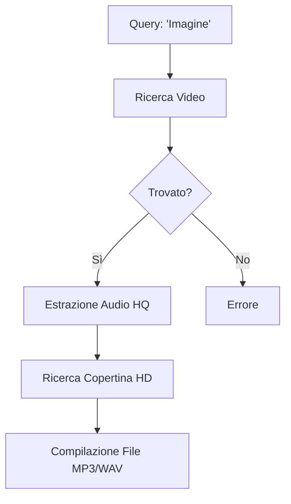

# 🎧 Download Audio AI (RaxeusLyric)

Questa funzione trasforma Raxeus in un potente motore di estrazione multimediale. Quando cerchi il titolo di una canzone su RaxeusLyric, l'intero sistema entra in azione per trovarti la traccia perfetta.

## Il Motore di Estrazione

### Qualità e Copertine
Il sistema non si limita a scaricare l'audio. L'algoritmo fa un *cross-reference* con i database musicali per trovare la **copertina ad altissima risoluzione**, inserendola a schermo durante la riproduzione in modo da offrirti un'esperienza musicale completa e professionale.
