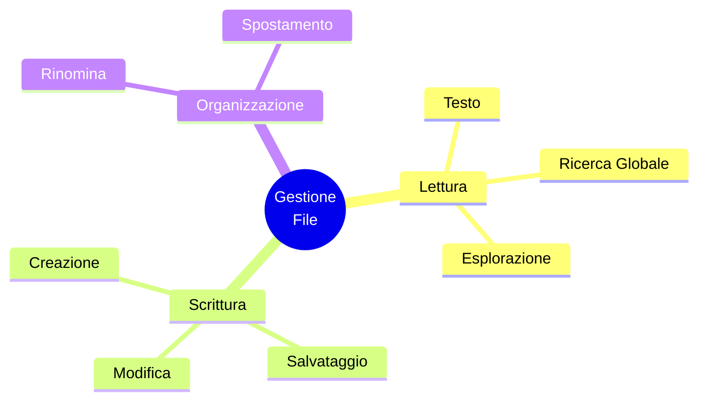

# 📂 Gestione File

Raxeus possiede "le mani" per operare direttamente sul tuo sistema operativo. Tramite strumenti integrati, agisce come un esploratore risorse avanzato controllato interamente dall'Intelligenza Artificiale.

## Azioni Autonome

## Sicurezza Prima di Tutto
Le azioni di modifica o cancellazione vengono generalmente spiegate prima di essere eseguite. L'agente sfrutta comandi sicuri per assicurarsi di toccare solo i file rilevanti per il tuo task, senza mai rischiare di cancellare dati di sistema o file personali importanti.
