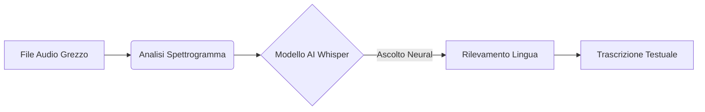

# 🎤 Trascrizione Magica (Whisper AI)

La Trascrizione Magica è il cuore pulsante di RaxeusLyric. Utilizza modelli avanzati di intelligenza artificiale sviluppati da OpenAI (Whisper) per "ascoltare" la canzone come farebbe un essere umano.

## Il Modello Acustico

### Perché usare l'AI?
Mentre le classiche applicazioni musicali si affidano a database di testi scritti a mano (che spesso mancano per canzoni indie, cover o remix), **RaxeusLyric genera il testo sul momento**. Ascolta le onde sonore e deduce le parole cantate, indipendentemente dalla lingua o dal genere musicale!
