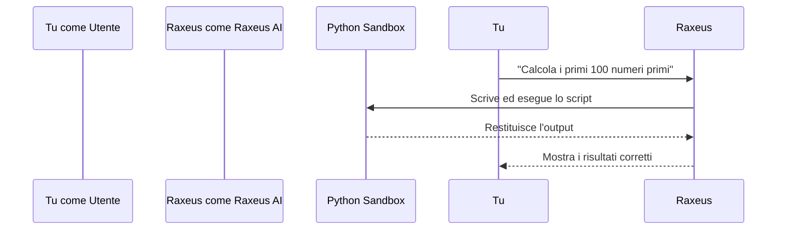

# 💻 Esecuzione Python

Raxeus non si limita a generare codice teorico: può letteralmente **eseguirlo all'interno di un ambiente sicuro (sandbox)** e restituirti i risultati.

## Cosa può fare?

- **Calcoli complessi**: Risolvere equazioni differenziali o calcoli statistici massivi.
- **Analisi Dati**: Creare grafici o elaborare dataset CSV.
- **Automazioni**: Rinominare file in blocco, scaricare file dal web, o convertire formati.

## Il Flusso di Esecuzione

> [!TIP]
> Prova a chiedere: *"Genera un grafico a torta sulle mie spese mensili e salvalo come immagine"*. Raxeus scriverà lo script con Matplotlib, lo eseguirà e creerà il file!
