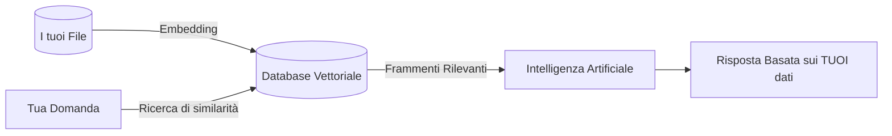

# 🧠 Memoria RAG (Retrieval-Augmented Generation)

Raxeus è in grado di leggere e ricordare i tuoi documenti personali utilizzando la tecnologia **RAG**, trasformando l'AI in un assistente completamente personalizzato.

## Architettura RAG

Invece di inviare gigabyte di testo all'AI (cosa impossibile e costosa), il sistema funziona così:

## Formati Supportati
- Documenti di testo (`.txt`, `.md`)
- Documenti PDF (`.pdf`)
- Codice Sorgente (`.py`, `.js`, `.html`, ecc.)

In questo modo l'AI non solo risponde in base alla sua conoscenza generale, ma sa esattamente cosa c'è scritto nei tuoi appunti privati, garantendo risposte precise e contestualizzate.
