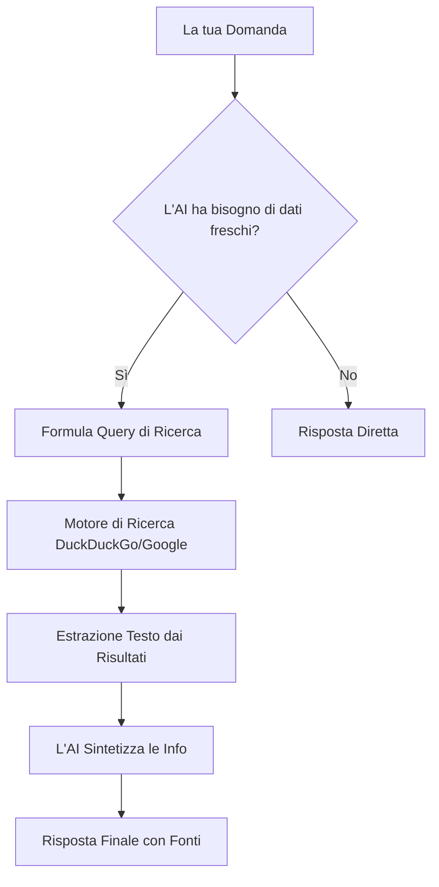

# 🌍 Ricerca Web

Raxeus utilizza un sistema di **ricerca intelligente in tempo reale** per fornire risposte che superano i limiti della sua conoscenza pre-addestrata.

## Come Funziona

Quando fai una domanda su eventi recenti, prezzi, o notizie, l'agente attiva autonomamente questo flusso:

## Vantaggi Principali
- **Nessuna allucinazione**: Se l'AI non sa una cosa, la cerca, riducendo drasticamente le informazioni inventate.
- **Dati Live**: Prezzi delle azioni, risultati sportivi o condizioni meteo sono sempre aggiornati.
- **Trasparenza**: Le fonti da cui provengono le informazioni possono essere verificate.
